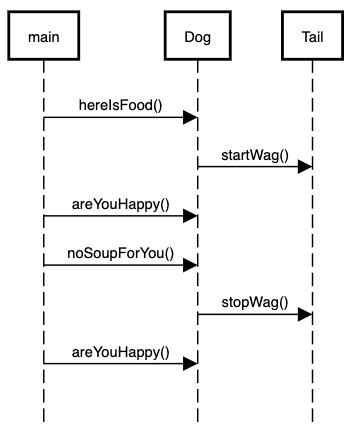

= CS 202 Lab 4, Spring 2022
:icons: font

== Overview

This lab is designed to give you experience with the composition relationship.

=== TL;DR

Create a `Dog` class that has a private member `Tail`. When you feed the dog, the tail will start wagging. When you deny food to the dog, the tail will stop wagging.

== Design

You will create two classes: the `Dog` and the `Tail`. The relationship between these classes is one of _composition_, as the tail cannot exist before or after the `Dog`. Another way of putting this is that when you create a `Dog` object, the `Tail` object will also be created. When you destroy the `Dog` object, the `Tail` object is destroyed as well.

== Steps

.Step 1
Create .h and .cpp files for the `Dog` class and the `Tail` class.
Create a makefile to generate an executable named `lab4` that will compile the `Dog` and `Tail` cpp files along with the `main.cpp` file.

.Step 2
Create the `Tail` class

* Add one private boolean member variable called `wagging` and default it to `false`.
* Add public methods `startWagging()` and `stopWagging()`. The `startWagging` function should change the `wagging` variable to `true`, and print out the message "I am wagging". The `stopWagging` function should change the `wagging` variable to `false` and print out "I am not wagging".

.Step 3
Create the `Dog` class

* The `Dog` class must have a constructor that takes one argument: a `std::string` with the name of the dog. The name should be stored in a private member variable. A method should be added named `printName()` that prints the dog's name to the console.
* Add a _private_ member variable of type `Tail` to the `Dog` class with the name `tail`
* Add a _private_ member variable of type _boolean_ to the `Dog` class named `happy`. Default the value to `false`.
* Add two methods to the Dog class: `hereIsFood` and `noSoupForYou`.
* The `hereIsFood` method should set the `happy` member variable to `true`, and then
** call the `startWagging` method on the `tail` member variable
** print "I love this food!".
* Add the public method `areYouHappy()` to the `Dog` class. This method should print "Yes, I am happy" if the member variable `happy` is true, and print "No, I am not happy" otherwise.
* The `noSoupForYou` method should call the `stopWagging` method on the `tail`, print "I am not happy", and set the `happy` variable to `false`.

.Step 4

The `main` function should instantiate a `Dog` object with the name "Tim" and then

* call `printName`
* call `hereIsFood`
* call `areYouHappy`
* call `noSoupForYou`
* call `areYouHappy`

.Example Output
----
Tim
I am wagging
I am happy
Yes, I am happy
I am not wagging
I am not happy
No, I am not happy
----

.Step 5

* Add and commit new files and changes to git.
* Push your code to Github using `git push origin master`
* Go to your Github account and verify that your code has correctly been pushed.
* Copy the URL for your repository, and submit that along with your Github username to WebCampus.
