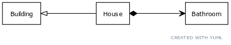

= CS 202 Lab 4, Spring 2022
:icons: font
:source-highlighter: highlighter.js

== Overview

This lab is designed to give you experience with the inheritance relationship. The assignment builds on what we have done so far in class, so it includes both inheritance and composition.

=== TL;DR
You are going to build the system shown in the diagram below.

In words, a house _is a_ building that _has_ a bathroom.

=== Research Areas
* `std::stringstream`
* calling the constructor of a parent class in an initializer list

== Design Requirements

.Building

* The `Building` has the following attributes:
** square footage
** number of stories

* Methods
** parameterized constructor that includes all attributes
** getters and setters for attributes
** `std::string buildingToString()`
*** this method should be `protected`
*** returns a formatted string in the form
+
----
Square Footage: 10
Number of Stories: 2
----
Note that the returned string includes newlines ('\n'). HINT: _Try using `std::stringstream` to build the string._

.House
* The house has the following attributes:
** number of bedrooms
** whether it has a garage
** maximum occupancy

* Methods
** Parameterized constructor that includes
*** all building attributes
*** all house attributes, including those for the bathroom. This constructor should instantiate the building class with the values that are passed in and set the attributes of the Bathroom class using accessors.
*** `printAttributes` - prints a summary of building, house, and bathroom attributes. This function should make use of the `buildingToString` method in the `Building` class.
+

.Example Output
----
****Building***
Square Footage: 2000
Number of Stories: 2

****House****
Number of Bedrooms: 3
Has Garage: yes
Maximum Occupancy: 6
Sinks in Bathroom: 2
----

.Bathroom
* The bathroom has the following attributes:
** number of sinks

* Methods
** getters and setters for number of sinks

== Steps

.Step 1
Complete the application and turn it in.
_Guessing you need more details..._

.Step 1 (for real)
Create the `Building` class with the appropriate attributes and constructor. In the `main` function, instantiate the class to ensure that it compiles.

.Step 2
Add the `buildingToString` method to the class, and for now make it `public`. Add the code below to test your method:

[source,cpp]
----
Building building(100,100);
std::cout << building.buildingToString() << std::endl;
----

Compile, run, and edit the method as needed until you get the required output. Do _not_ just move ahead and come back to it! When you are satisfied that the function is working correctly remove the instantiation from the `main` function and make the method `protected`

.Step 3
Create the `Bathroom` class with the required attribute and getters/setters.

.Step 4
Create the `House` class with the required attributes, including the private attribute `Bathroom bathroom`.

.Step 5
Create the constructor for the `House` class. This constructor is going to take as parameters all the attributes of the `Building` class, the `House` class, and the `Bathroom` class. Use the constructor member _initializer list_ to set all the attributes of the `House` class and to call the `Building` constructor with the passed in attributes. You will need to use a setter function to set the number of sinks attribute of the `Bathroom` class.

.Step 6
If you have not done so already, create a makefile to build the application. The makefile should specify `lab5` as the  executable.

.Step 7
In the `main` method, instantiate the `House` class with the following data:

* building square footage: 2000
* building number of stories: 2
* number of bedrooms: 3
* has garage: true
* maximum occupancy: 6
* sinks in bathroom: 2

.Step 8
* Call the `printAttributes` method and verify that the output is what was specified above.

.Step 9

* Add and commit new files and changes to git.
* Push your code to Github using `git push origin master`
* Go to your Github account and verify that your code has correctly been pushed.
* Copy the URL for your repository, and submit that along with your Github username to WebCampus.
