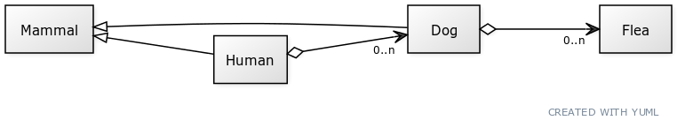

= CS 202 Lab 6, Spring 2022
:icons: font
:source-highlighter: highlighter.js

== Overview

In this lab, you will complete the implementation of several classes. The assignment is meant to give you some experience using dynamic memory allocation and aggregation.

== The Design

You will be building a system where a human can have zero or more dogs, and each dog can have zero or more fleas.

== Details

You are given the `main.cpp` and all the class files required for the project. The `main` method in `main.cpp` is complete and is not to be altered. The expected printout when you run the application is as follows:

----
Name: Doug
Doug has 2 dog(s)
The dog named Tim has brown hair and 2 flea(s)
The dog named Terry has blue hair and 0 flea(s)
Name: Doug
Doug has 2 dog(s)
The dog named Tim has brown hair and 1 flea(s)
The dog named Terry has blue hair and 0 flea(s)
----

== Design Requirements
* The `Human` class should have a private attribute `std::vector<Dog*> dogs`. Similarly, the `Dog` class should have a private attribute `std::vector<Flea*> fleas`.
* The `name` and `hairColor` fields are attributes of the `Mammal` class, so constructors for the other mammals should instantiate the `Mammal` parent class with those attributes.

== The Challenge

You should be able to determine what methods are required for each class based on the code in `main`.  For example,
if you look at just the first few lines, you can see that the Dog, Human, and Flea all require parameterized constructors. But...the attributes in those constructors are part of the `Mammal` class, so you have to initialize the `Mammal` class from each of those constructors with the parameters that were passed in. The flea, of course, is different since it does not inherit from the `Mammal` class, but it still will need a parameterized constructor.

The `printDetails` method of the `Human` class may be a bit tricky. All the printing (std:cout...) commands should be in that one method, so you will need to think about what accessors, if any, you need from the other classes to do the printout. *The Human class should _not_ interact directly with the Flea class!*

.When you are done...

* Add and commit new files and changes to git.
* Push your code to Github using `git push origin master`
* Go to your Github account and verify that your code has correctly been pushed.
* Copy the URL for your repository, and submit that along with your Github username to WebCampus.

